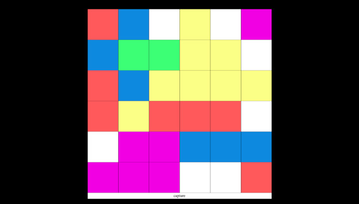

# [Color Changing Tiles](https://teflassistant.com/color-changing-tiles/)
A generic gameboard of color changing tiles.

## Purpose/Goal
This was originally a clone of a game I saw someone demo at a teacher's training event. 
There was a significant problem with the version they made because of the quirks with PowerPoint, so I decided to recreate it in JavaScript.  
It has evolved a bit more since the original and now it's not so much of a clone anymore.

## Operation
* click the squares to change the colors.
* click the "capture" button to capture the squares that are between the nearest matching square of the same color in all directions.
* to reset, just refresh the page.
* when clicked, a white square will cycle through 5 colors and not return to white as it is now "in play".
* it is meant to be a tool that keeps track of what "teams" have "won" which squares.
* this is meant to be a flexible game where you make up the rules.
* the game board keeps track of the game state.

## Tech/Libraries Used
* HTML
* CSS
* JavaScript

## Problems/Solutions
* getting the squares to adapt to the most restrictive window dimension so that it would always be square and fit within the window was a small challenge after having not coded in JavaScript for a few months.  
* getting the capture of other squares to work automatically would require some other mechanism like keeping track of what player was the current one, so instead I added a button to allow the user to choose when to capture so if they make a mistake in clicking a square, it would not ruin the state of the game by automatically capturing other colors.  

## More Information
N/A
